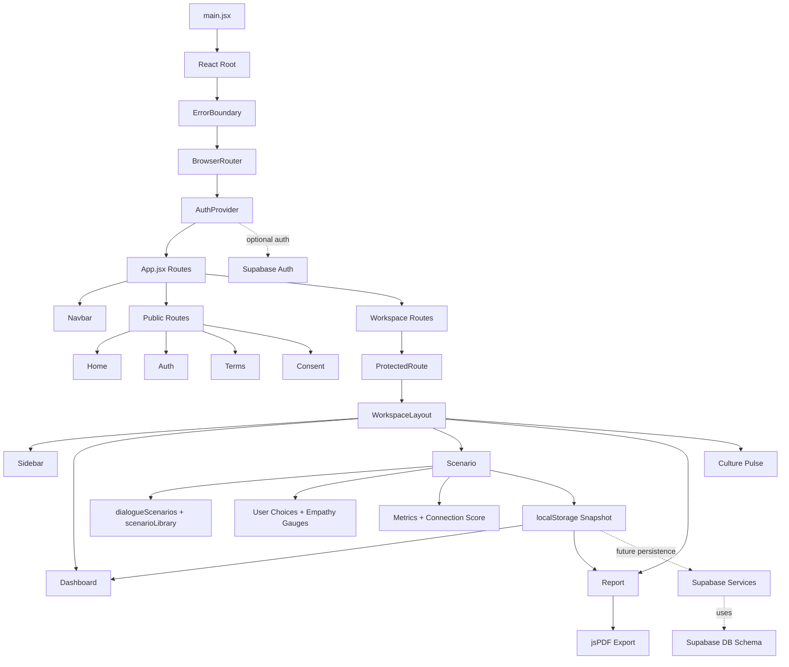

# Trading Places Prototype - Architecture Diagram

## Legend
- Solid arrows: current, active runtime flow.
- Dotted arrows: optional or planned integration (Supabase).

## Notes
- Authentication is implemented but bypassed in the prototype via a hardcoded `SKIP_AUTH` flag.
- localStorage is the current single source of truth for session data.
- Supabase services and migrations are present but not connected to the UI flow.
